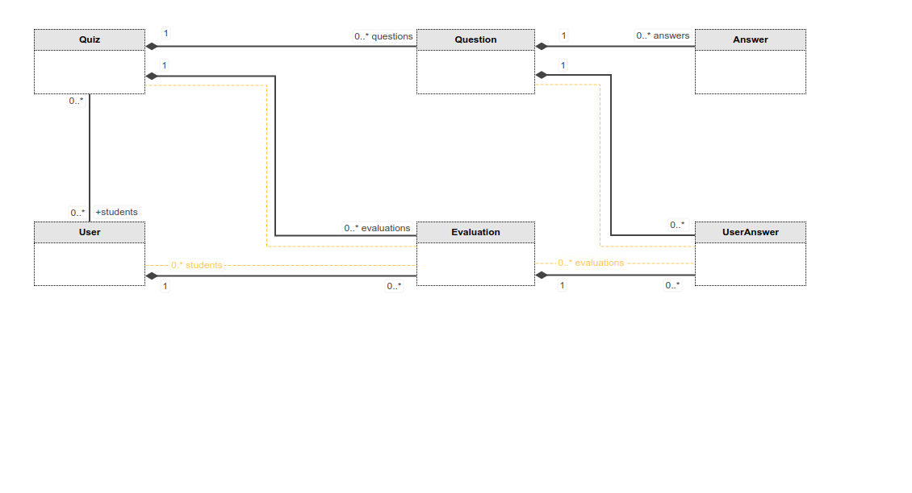

# Quiz app

### ❄ Project structure 


### 💎 Database schema

```mysql-psql
DROP TABLE IF EXISTS user CASCADE;
DROP TABLE IF EXISTS quiz CASCADE;
DROP TABLE IF EXISTS user_quiz CASCADE ;
DROP TABLE IF EXISTS question CASCADE ;
DROP TABLE IF EXISTS answer CASCADE ;
DROP TABLE IF EXISTS evaluation CASCADE ;
DROP TABLE IF EXISTS user_answer CASCADE ;

create table if not exists user
(
	username varchar(40) NOT NULL primary key,
	password text,
	year smallint,
	groupNumber text
);


create table if not exists quiz
(
	id smallint NOT NULL AUTO_INCREMENT primary key,
	name text,
	level text,
	date text
);

create table if not exists user_quiz
(
	username varchar(40),
	quiz_id smallint       
);

create table if not exists question
(
	id smallint NOT NULL AUTO_INCREMENT primary key,
	question text,
	correctAnswer text,
	quiz_id smallint
);

create table if not exists answer
(
	id smallint NOT NULL AUTO_INCREMENT primary key,
	text text,
    question_id smallint
);

create table if not exists evaluation
(
	id smallint NOT NULL AUTO_INCREMENT primary key,
	score text,
	quiz_id smallint,
    student varchar(40)
);

create table if not exists user_answer
(
	id smallint NOT NULL AUTO_INCREMENT primary key,
	text text,
	question_id smallint,
    evaluation_id smallint
);

ALTER TABLE evaluation
ADD FOREIGN KEY (quiz_id) REFERENCES quiz(id);

ALTER TABLE evaluation
ADD FOREIGN KEY (student) REFERENCES user(username);

ALTER TABLE user_answer
ADD FOREIGN KEY (question_id) REFERENCES question(id);

ALTER TABLE user_answer
ADD FOREIGN KEY (evaluation_id) REFERENCES evaluation(id);

ALTER TABLE user ADD UNIQUE(username);

ALTER TABLE user_quiz
ADD FOREIGN KEY (username) REFERENCES user(username);

ALTER TABLE user_quiz
ADD FOREIGN KEY (quiz_id) REFERENCES quiz(id);

ALTER TABLE question
ADD FOREIGN KEY (quiz_id) REFERENCES quiz(id);

ALTER TABLE answer
ADD FOREIGN KEY (question_id) REFERENCES question(id);
```

### 🚀 Swagger input
- Register
```json5
{
  "username": "ionpop@gmail.com",
  "password": "test",
  "year": 2,
  "group": "30236"
}

```

- Add quiz
```json5
{
  "name": "JavaScript",
  "level": "medium",
  "questions": [
    {
      "question": "Who invented JavaScript?",
      "correctAnswer": "c",
      "answers": [
       "Douglas Crockford",
        "Sheryl Sandberg",
        "Brendan Eich"
      ]
    },
 {
      "question": "Which one of these is a JavaScript package manager?",
      "correctAnswer": "c",
      "answers": [
       "Node.js",
       "TypeScript",
       "npm"
      ]
    }
  ]
}
```
